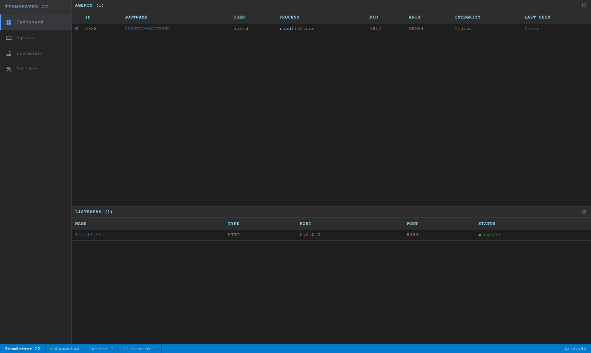
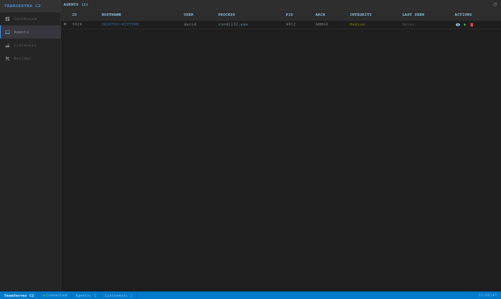
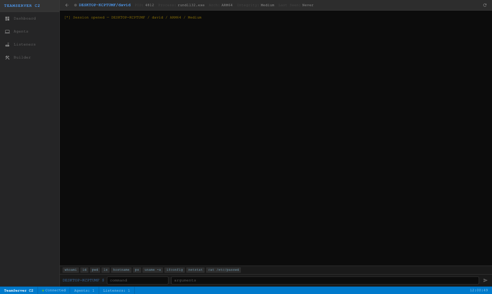
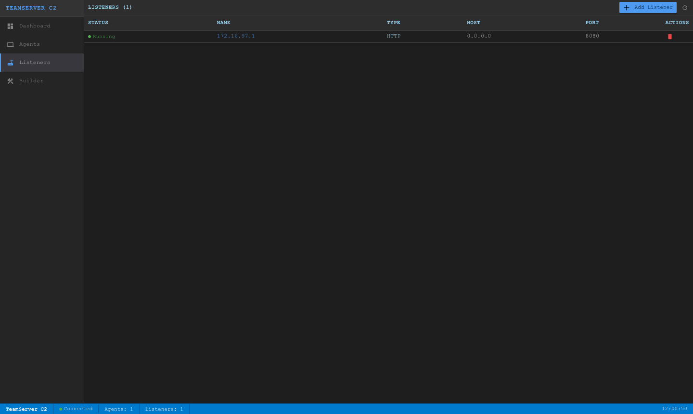
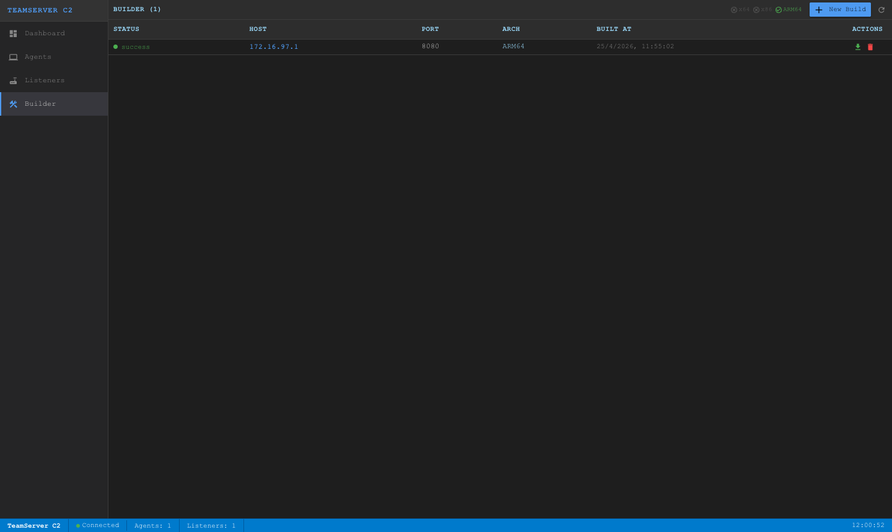
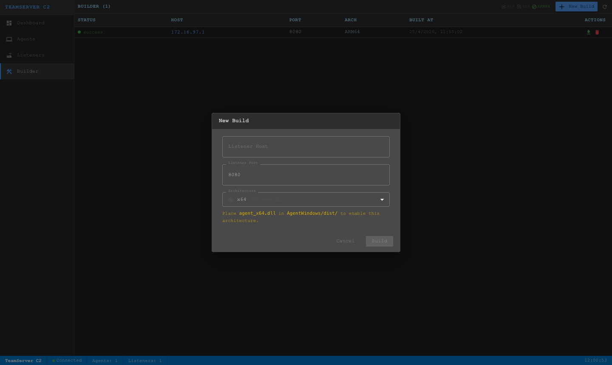

# C2 Framework

A Command & Control (C2) framework built for authorized penetration testing and red team operations. It consists of a Python/Flask TeamServer, an HTTP listener that agents beacon to, cross-platform implants (Python and C++/Windows DLL), and a React operator UI.

> **Legal notice** — Only use against systems you own or have explicit written authorization to test.

---

## Screenshots

### Dashboard
Live overview of connected agents and active listeners, auto-refreshes every 30 seconds.



### Agents
Full agent table with status indicators, last-seen timestamps, and per-agent actions.



### Agent Console
Terminal-style interactive console. Send commands with built-in quick-command chips; output is polled and appended automatically.



### Listeners
Manage HTTP listeners. Create new ones on any port; stop and remove them at any time.



### Builder
Generate ready-to-deploy agent DLLs by patching a pre-compiled binary with your listener's IP and port. The toolbar shows which architectures have a base DLL available.



### Builder — New Build Dialog
Select target architecture (only architectures with a base DLL in `AgentWindows/dist/` are enabled), enter the listener host and port, and click Build. Patching completes in under a millisecond.



---

## Architecture

```
Operator Browser
      │
      │  HTTP REST  (port 8000)
      ▼
┌─────────────────────────────────────────────┐
│               TeamServer                    │
│  Flask API — agents · listeners · builder   │
│  ┌─────────────┐  ┌──────────────────────┐  │
│  │ AgentService│  │  ListenerService     │  │
│  │ (singleton  │  │  (singleton + list)  │  │
│  │  + lock)    │  └──────────────────────┘  │
│  └──────┬──────┘  ┌──────────────────────┐  │
│         │         │  BuilderService       │  │
│         │         │  (binary patcher)     │  │
│         │         └──────────────────────┘  │
└─────────┼───────────────────────────────────┘
          │  shared in-memory AgentService (singleton)
          ▼
┌──────────────────┐
│  HTTPListener    │  Python HTTPServer — agent beacon handler
│  (per-listener   │  (one thread per listener, configurable port)
│   daemon thread) │
└────────┬─────────┘
         │  HTTP POST every 5 s
         │  Authorization: Bearer <base64(metadata_json)>
         │  Body: {"results": "<base64(task_results_json)>"}
         ▼
   Agent (Python or Windows DLL)
```

**Beacon cycle:**
1. Agent sends `POST /` to the HTTP listener with its metadata in the `Authorization` header and any pending task results in the body.
2. Listener registers the agent on first contact; on subsequent beacons it records `lastseen` and stores results.
3. Listener responds with `{"tasks": [...]}` — the agent executes each task and queues results for the next beacon.

---

## Components

### TeamServer (`TeamServer/`)

Flask REST API consumed by the operator frontend and the HTTP listener.

| File | Purpose |
|------|---------|
| `main.py` | App factory — registers blueprints, runs on port 8000 |
| `Controllers/agent_controller.py` | Agent CRUD, task queueing, result retrieval |
| `Controllers/listeners_controller.py` | Listener lifecycle (create, list, remove) |
| `Controllers/builder_controller.py` | Agent builder — check DLL availability, patch & serve |
| `Services/agent_service.py` | Thread-safe in-memory agent store (singleton + `threading.Lock`) |
| `Services/listeners_service.py` | In-memory listener store (singleton) |
| `Services/builder_service.py` | Binary patcher — finds magic markers in DLL and overwrites them |
| `Models/Agent/` | `Agent`, `AgentMetadata`, `Task`, `TaskResult` |
| `Models/Listener/` | `Listener` ABC, `HTTPListener`, `HTTPRequestHandler` |
| `Models/Build/` | `Build` dataclass, `BuildStatus` enum |

### HTTP Listener (inside TeamServer)

Runs as a `threading.Thread` daemon alongside the Flask API. Each created listener is an independent `HTTPServer` on its own port. The listener shares the `AgentService` singleton with the Flask API so agents are visible to the operator immediately.

### Python Agent (`Agent/`)

Cross-platform implant (Linux / macOS).

| File | Purpose |
|------|---------|
| `main.py` | Entry point — collects metadata, starts worker thread + comms loop |
| `Models/Agent.py` | Task queue, result queue, auto-discovered command dispatch |
| `Models/AgentMetadata.py` | Beacon metadata (id, hostname, username, …) |
| `Models/Task.py` / `TaskResult.py` | Task and result data classes |
| `Models/Commands/` | Built-in command implementations (auto-discovered via `pkgutil`) |
| `Modules/httpcomm.py` | HTTP communication module — beacons every 5 s |

**Built-in commands**

| Command | Description |
|---------|-------------|
| `pwd` | Print working directory |
| `cd <path>` | Change directory |
| `ls [path]` | List directory contents |
| `shell <cmd…>` | Run arbitrary shell command via `subprocess` |
| `ps` | List running processes |
| `mkdir <path>` | Create directory |
| `rmdir <path>` | Remove directory |

### Windows Agent (`AgentWindows/`)

C++ Visual Studio project that builds a **DLL**. When injected into a process, `DllMain` fires on `DLL_PROCESS_ATTACH` and starts the agent on a new thread without blocking the loader lock.

| File | Purpose |
|------|---------|
| `main.cpp` | `DllMain` entry point + `AgentThread` worker |
| `AgentConfig.cpp` / `AgentConfig.h` | Magic-prefixed config arrays patched by TeamServer |
| `Agent.cpp` / `Agent.h` | Task queue, result queue, command dispatch |
| `HTTPCommunicationModule.cpp` / `.h` | HTTP beaconing loop (WinHTTP) |
| `HttpClient.cpp` / `.h` | Low-level WinHTTP wrapper |
| `Helpers.cpp` / `.h` | Base64, JSON helpers, system-info (hostname, arch, integrity level) |
| `Commands.h` | Command function declarations |
| `Whoami.cpp`, `Shell.cpp`, `Run.cpp`, `Pwd.cpp`, `Cd.cpp`, `Ls.cpp` | Built-in command implementations |

**Binary patching** — `AgentConfig.cpp` embeds two magic-prefixed arrays in the `.data` section of the DLL:

```
AGENT_C2_HOST_CFG:  [0xDE AD BE EF C2 C2 C2 C2] [hostname/IP, null-padded to 64 bytes]
AGENT_C2_PORT_CFG:  [0xDE AD BE EF C2 C2 C2 C3] [port string, null-padded to  8 bytes]
```

The TeamServer's `BuilderService._patch_dll()` scans the compiled DLL bytes for each 8-byte magic prefix and overwrites the payload bytes that follow with the operator-supplied values. No recompilation needed.

### Frontend (`c2-frontend/`)

React 19 + TypeScript operator UI. MUI v7 dark theme. No global state manager — each component manages its own state and calls the API directly.

| Route | Component | Purpose |
|-------|-----------|---------|
| `/` | `Dashboard` | Split-panel overview — agents (top 60%) + listeners (bottom 40%), auto-refreshes every 30 s |
| `/agents` | `Agents` | Agent table — status dot, metadata, interact / check-in / remove actions |
| `/agent/:id` | `AgentDetail` | Terminal console — send tasks, poll results every 5 s, quick-command chips |
| `/listeners` | `Listeners` | Create / remove HTTP listeners |
| `/builder` | `Builder` | Patch pre-compiled DLL with listener host/port, download result |

---

## Prerequisites

### TeamServer & Python Agent
- Python 3.12+

```bash
pip install flask flask-cors flasgger requests
```

### Windows Agent (compile step only)
- Windows 10/11
- Visual Studio 2022 with the **Desktop development with C++** workload

### Frontend
- Node.js 18+ / npm

```bash
cd c2-frontend && npm install
```

---

## Running

### 1. Start the TeamServer

```bash
cd TeamServer
python main.py
# API:     http://127.0.0.1:8000
# Swagger: http://127.0.0.1:8000/apidocs
```

### 2. Create a listener

Open the frontend and go to **Listeners → Add Listener**, or use curl:

```bash
curl -X POST http://localhost:8000/listeners/create \
  -H "Content-Type: application/json" \
  -d '{"name": "http1", "type": "http", "port": 8080}'
```

### 3. Deploy an agent

**Python agent (Linux/macOS)** — edit `Agent/main.py` line 25 to set the listener address, then:

```bash
cd Agent && python main.py
```

**Windows DLL agent** — see the [Builder workflow](#builder-workflow) section below.

### 4. Start the operator UI

```bash
cd c2-frontend && npm start
# Opens http://localhost:3000
```

---

## Builder Workflow

The builder patches a pre-compiled DLL binary with the target listener's host and port. No compiler or Visual Studio is required on the operator machine — only when producing the initial base DLL.

### Step 1 — Compile the base DLL (one-time, on Windows)

1. Open `AgentWindows/AgentWindows.sln` in Visual Studio 2022.
2. Select **Release / x64** (or x86 / ARM64).
3. Build → the output DLL is in `AgentWindows/x64/Release/AgentWindows.dll`.

### Step 2 — Place the base DLL

Copy the compiled DLL to the `AgentWindows/dist/` folder with the arch-specific name:

```
AgentWindows/dist/agent_x64.dll    ← Release/x64
AgentWindows/dist/agent_x86.dll    ← Release/x86 (Win32)
AgentWindows/dist/agent_ARM64.dll  ← Release/ARM64
```

The TeamServer checks this folder at startup. The Builder page shows a ✓/✗ indicator in the toolbar for each architecture.

### Step 3 — Generate a patched DLL from the UI

1. Navigate to **Builder → New Build**.
2. Enter the listener **Host** and **Port**.
3. Select the target **Architecture** (only architectures with a base DLL are enabled).
4. Click **Build** — patching completes instantly.
5. Click the download icon to save the ready-to-deploy DLL.

### Deploying the DLL

Inject the downloaded DLL into any Windows process using your preferred injection technique. `DllMain` fires on `DLL_PROCESS_ATTACH`, immediately spawns `AgentThread` on a new OS thread, and returns — the host process is not blocked.

---

## Configuration

All configuration is currently hardcoded. Key values to change:

| Location | Setting | Default |
|----------|---------|---------|
| `TeamServer/main.py:29` | TeamServer API port | `8000` |
| `Agent/main.py:25` | Listener host (Python agent) | `localhost` |
| `Agent/main.py:25` | Listener port (Python agent) | `8080` |
| `AgentWindows/AgentWindows/AgentConfig.cpp` | Default host in base DLL | `172.16.97.1` |
| `AgentWindows/AgentWindows/AgentConfig.cpp` | Default port in base DLL | `8080` |
| `c2-frontend/src/services/api.ts:54` | TeamServer base URL | `http://localhost:8000` |

The base DLL defaults in `AgentConfig.cpp` only matter for manual runs directly from Visual Studio; they are always overwritten by the patcher before delivery.

---

## TeamServer API Reference

Base URL: `http://localhost:8000`  
Interactive docs: `http://localhost:8000/apidocs`

### Agents

| Method | Path | Description |
|--------|------|-------------|
| `GET` | `/agents/` | List all agents |
| `GET` | `/agents/{id}` | Get agent by ID |
| `POST` | `/agents/` | Register an agent manually (body: metadata JSON) |
| `DELETE` | `/agents/{id}` | Remove agent |
| `POST` | `/agents/{id}/checkin` | Mark agent last-seen as now |
| `POST` | `/agents/{id}/checkout` | Clear agent last-seen (mark offline) |
| `POST` | `/agents/{id}/task` | Queue a task `{command, arguments, file?}` |
| `GET` | `/agents/{id}/tasks` | List all queued tasks |
| `GET` | `/agents/{id}/results` | List all task results |
| `GET` | `/agents/{id}/results/{task_id}` | Get result for a specific task |

### Listeners

| Method | Path | Description |
|--------|------|-------------|
| `GET` | `/listeners/` | List active listeners |
| `GET` | `/listeners/{name}` | Get listener by name |
| `POST` | `/listeners/create` | Create & start listener `{name, type, port}` |
| `DELETE` | `/listeners/remove` | Stop & remove listener `{name}` |

### Builder

| Method | Path | Description |
|--------|------|-------------|
| `GET` | `/builder/check` | Check which arch DLLs are available for patching |
| `GET` | `/builder/` | List all builds |
| `POST` | `/builder/` | Patch a DLL — body: `{host, port, arch}` → returns Build |
| `GET` | `/builder/{id}` | Get build status and metadata |
| `GET` | `/builder/{id}/download` | Download the patched DLL |
| `DELETE` | `/builder/{id}` | Delete build record and artifact |

### Agent Beacon Protocol

Agents communicate with the **HTTPListener** (default port 8080), not the TeamServer REST API.

```
POST /
Authorization: Bearer <base64(metadata_json)>
Content-Type: application/json

{"results": "<base64(json_array_of_task_results)>"}
```

**First beacon** (agent not yet registered) — response `201`:
```json
{"message": "Agent created successfully"}
```

**Subsequent beacons** — response `200`:
```json
{"tasks": [{"id": 1234, "command": "whoami", "arguments": [], "file": ""}]}
```

---

## Adding New Commands

### Python Agent

Create a file in `Agent/Models/Commands/`. The agent discovers all `Command` subclasses automatically via `pkgutil` — no registration needed.

```python
# Agent/Models/Commands/MyCommand.py
from Models.Command import Command
from Models.Task import Task

class MyCommand(Command):
    def __init__(self):
        self.name = "mycommand"      # name sent by the operator

    def execute(self, task: Task) -> str:
        args = task.get_arguments()  # List[str]
        return "result string"
```

### Windows Agent

1. Declare in `Commands.h`:
   ```cpp
   std::string MyCommand(std::vector<std::string> arguments);
   ```
2. Implement in a new `.cpp` file.
3. Register in `Agent.cpp → loadCommands()`:
   ```cpp
   commands["mycommand"] = &MyCommand;
   ```
4. Add the `.cpp` to `AgentWindows.vcxproj` under `<ClCompile>`.

---

## Project Structure

```
C2/
├── README.md
├── .gitignore
│
├── TeamServer/                        # Python/Flask REST API (port 8000)
│   ├── main.py
│   ├── Controllers/
│   │   ├── agent_controller.py
│   │   ├── listeners_controller.py
│   │   └── builder_controller.py
│   ├── Services/
│   │   ├── agent_service.py           # thread-safe singleton
│   │   ├── listeners_service.py       # singleton
│   │   └── builder_service.py         # binary patcher
│   ├── Models/
│   │   ├── Agent/
│   │   │   ├── agent.py
│   │   │   ├── agent_metadata.py
│   │   │   ├── task.py
│   │   │   └── task_result.py
│   │   ├── Build/
│   │   │   └── build.py               # Build dataclass + BuildStatus enum
│   │   └── Listener/
│   │       ├── listener.py            # ABC
│   │       └── http_listener/
│   │           ├── httplistener.py    # HTTPServer wrapper
│   │           └── http_handler.py    # beacon request handler
│   └── builds/                        # patched DLL artifacts (git-ignored)
│
├── Agent/                             # Python implant (Linux / macOS)
│   ├── main.py
│   ├── Models/
│   │   ├── Agent.py
│   │   ├── AgentMetadata.py
│   │   ├── Command.py                 # Command ABC
│   │   ├── Task.py
│   │   ├── TaskResult.py
│   │   └── Commands/                  # auto-discovered via pkgutil
│   │       ├── CdCommand.py
│   │       ├── LsCommand.py
│   │       ├── PwdCommand.py
│   │       ├── ShellCommand.py
│   │       ├── PsCommand.py
│   │       ├── MkdirCommand.py
│   │       └── RmdirCommand.py
│   └── Modules/
│       ├── comm.py                    # CommunicationModule ABC
│       └── httpcomm.py               # HTTP beacon loop
│
├── AgentWindows/                      # C++ Windows DLL implant
│   ├── AgentWindows.sln
│   ├── dist/                          # pre-compiled base DLLs (git-ignored)
│   │   ├── agent_x64.dll
│   │   ├── agent_x86.dll
│   │   └── agent_ARM64.dll
│   └── AgentWindows/
│       ├── AgentWindows.vcxproj
│       ├── main.cpp                   # DllMain + AgentThread
│       ├── AgentConfig.cpp / .h       # magic-marker config arrays
│       ├── Agent.cpp / .h
│       ├── HTTPCommunicationModule.cpp / .h
│       ├── HttpClient.cpp / .h
│       ├── Helpers.cpp / .h
│       ├── Commands.h
│       └── *.cpp                      # command implementations
│
├── c2-frontend/                       # React 19 + TypeScript operator UI
│   ├── src/
│   │   ├── App.tsx                    # router: /, /agents, /agent/:id, /listeners, /builder
│   │   ├── theme.ts                   # MUI dark theme
│   │   ├── services/api.ts            # agentAPI, listenerAPI, builderAPI
│   │   └── components/
│   │       ├── Dashboard.tsx
│   │       ├── Agents.tsx
│   │       ├── AgentDetail.tsx
│   │       ├── Listeners.tsx
│   │       ├── Builder.tsx
│   │       ├── Sidebar.tsx
│   │       └── StatusBar.tsx
│   └── CLAUDE.md                      # frontend-specific dev guidance
│
└── docs/
    └── screenshots/                   # UI screenshots (captured via Playwright)
```
