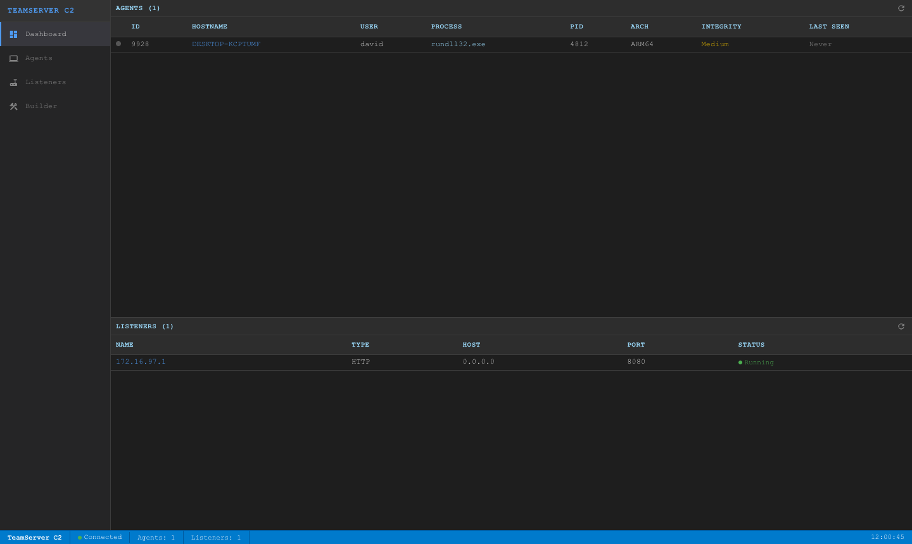
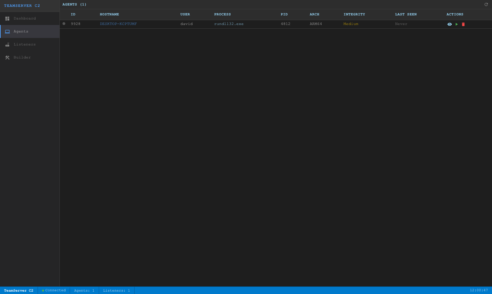
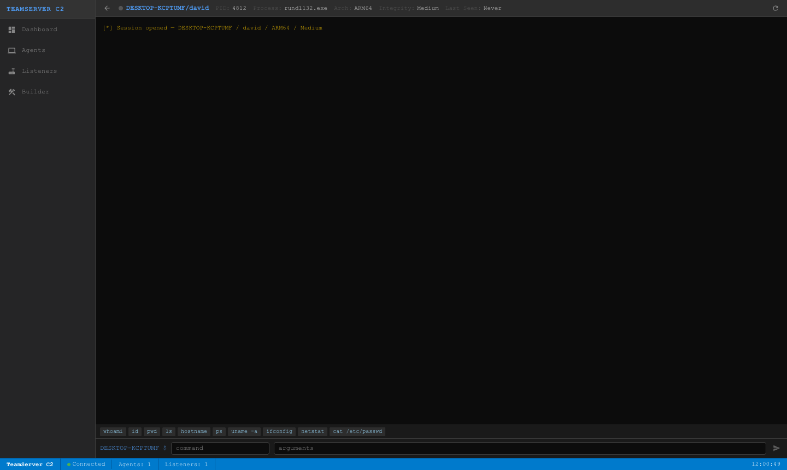
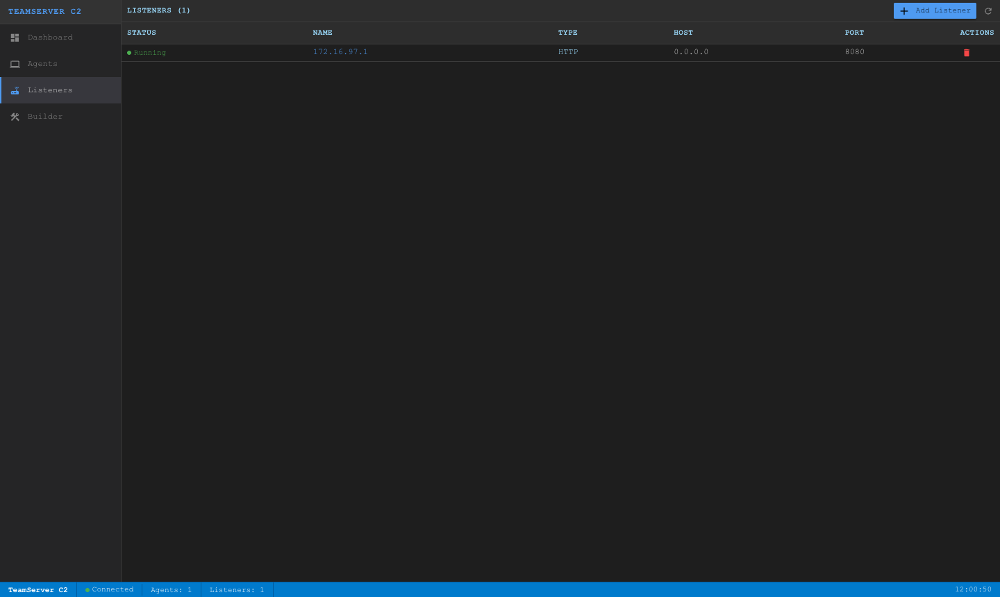
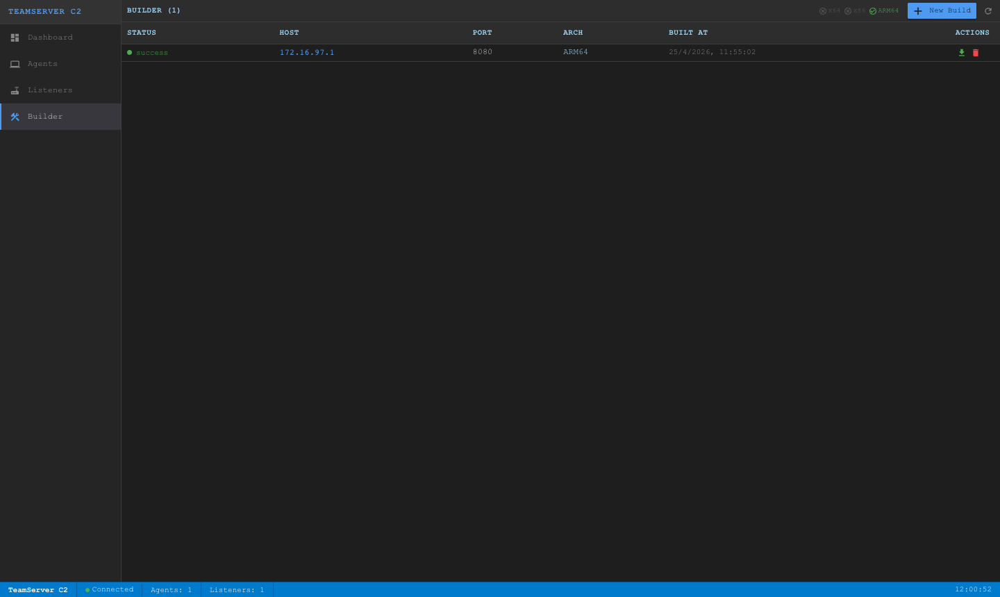
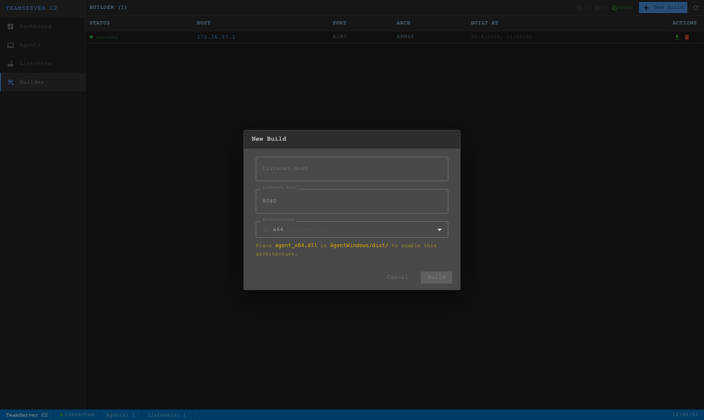

# C2 Framework

A Command & Control (C2) framework built for authorized penetration testing and red team operations. It consists of a Python/Flask TeamServer, an HTTP listener that agents beacon to, cross-platform implants (Python and C++/Windows DLL), and a React operator UI.

> **Legal notice** — Only use against systems you own or have explicit written authorization to test.

---

## Screenshots

### Dashboard
Live overview of connected agents and active listeners, auto-refreshes every 30 seconds.



### Agents
Full agent table with status indicators, last-seen timestamps, and per-agent actions. Paginated at 15 rows per page.



### Agent Console
Terminal-style interactive console. Send commands with built-in quick-command chips; output is polled and appended automatically. Navigate command history with ArrowUp / ArrowDown.



### Listeners
Manage HTTP listeners. Create new ones on any port; stop and remove them at any time.



### Builder
Generate ready-to-deploy agent DLLs by patching a pre-compiled binary with your listener's IP, port, beacon sleep interval, and jitter. Patching runs asynchronously — the build table polls automatically while a build is in progress.



### Builder — New Build Dialog
Select target architecture (only architectures with a base DLL in `AgentWindows/dist/` are enabled), enter the listener host, port, sleep interval (ms), and jitter (ms), and click Build.



---

## Architecture

```
Operator Browser
      │
      │  HTTP REST  (port 8000)
      ▼
┌──────────────────────────────────────────────────────┐
│                    TeamServer                        │
│  Flask API — agents · listeners · builder            │
│                                                      │
│  app.extensions                                      │
│  ┌───────────────┐  ┌──────────────────┐             │
│  │  AgentService │  │ ListenerService  │             │
│  │  (DB-backed,  │  │  (thread-safe    │             │
│  │  thread-safe) │  │   list)          │             │
│  └───────┬───────┘  └──────────────────┘             │
│          │           ┌──────────────────┐             │
│          │           │  BuilderService  │             │
│          │           │  (DB-backed,     │             │
│          │           │  async patcher)  │             │
│          │           └──────────────────┘             │
│          │                                            │
│  ┌───────▼────────────────────────────────────────┐  │
│  │              SQLite (c2.db)                    │  │
│  │  agents · pending_tasks · results · builds     │  │
│  └────────────────────────────────────────────────┘  │
└──────────────────────┬───────────────────────────────┘
                       │  injected agent_service
                       ▼
┌──────────────────────────────────────────┐
│  HTTPListener  (ThreadingHTTPServer)     │
│  (per-listener daemon thread,            │
│   configurable port)                     │
│  Handler created via make_handler(svc)   │
└────────────────┬─────────────────────────┘
                 │  HTTP POST every 5 s
                 │  Authorization: Bearer <base64(metadata_json)>
                 │  Body: {"results": "<base64(task_results_json)>"}
                 ▼
          Agent (Python or Windows DLL)
```

**Beacon cycle:**
1. Agent sends `POST /` to the HTTP listener with its metadata in the `Authorization` header and any pending task results in the body.
2. Listener registers the agent on first contact via `AgentService.add_agent()`; on subsequent beacons it calls `checkin_agent()` (updates `lastseen` in DB) and `record_results()` (persists results).
3. `pop_pending_tasks()` drains the agent's task queue and deletes those tasks from the DB; the tasks are returned to the agent in the response.
4. All agent, task, and result state survives a TeamServer restart.

---

## Components

### TeamServer (`TeamServer/`)

Flask REST API consumed by the operator frontend and the HTTP listener.

| File | Purpose |
|------|---------|
| `main.py` | App factory — initialises DB + services in `app.extensions`, registers blueprints, runs on port 8000 |
| `Database/database.py` | SQLite persistence (WAL mode, thread-safe) — agents, pending_tasks, results, builds |
| `Controllers/agent_controller.py` | Agent CRUD, task queueing, result retrieval; services from `current_app.extensions` |
| `Controllers/listeners_controller.py` | Listener lifecycle — passes `agent_service` to each new `HTTPListener` |
| `Controllers/builder_controller.py` | Agent builder — check DLL availability, queue patch & serve |
| `Services/agent_service.py` | Thread-safe agent store; loads from DB on startup; exposes `add_task`, `pop_pending_tasks`, `record_results`, `checkin_agent` |
| `Services/listeners_service.py` | Thread-safe listener store |
| `Services/builder_service.py` | Binary patcher — finds four magic markers in DLL and overwrites them; runs in background thread; persists builds to DB |
| `Models/Agent/` | `Agent`, `AgentMetadata`, `Task`, `TaskResult` |
| `Models/Listener/` | `Listener` ABC, `HTTPListener` (ThreadingHTTPServer), `make_handler()` factory |
| `Models/Build/` | `Build` dataclass + `Build.from_row()`, `BuildStatus` enum |

### HTTP Listener (inside TeamServer)

Runs as a `threading.Thread` daemon alongside the Flask API. Each created listener is an independent `ThreadingHTTPServer` on its own port — concurrent agent beacons are handled on separate threads. The `make_handler(agent_service)` factory injects the service into the handler class so no global state is needed.

### Python Agent (`Agent/`)

Cross-platform implant (Linux / macOS).

| File | Purpose |
|------|---------|
| `main.py` | Entry point — collects metadata, starts worker thread + comms loop |
| `Models/Agent.py` | Task queue, result queue, auto-discovered command dispatch |
| `Models/AgentMetadata.py` | Beacon metadata (id, hostname, username, …) |
| `Models/Task.py` / `TaskResult.py` | Task and result data classes |
| `Models/Commands/` | Built-in command implementations (auto-discovered via `pkgutil`) |
| `Modules/httpcomm.py` | HTTP communication module — beacons at a configurable interval with ± jitter |

**Built-in commands**

| Command | Description |
|---------|-------------|
| `pwd` | Print working directory |
| `cd <path>` | Change directory |
| `ls [path]` | List directory contents |
| `shell <cmd…>` | Run arbitrary shell command via `subprocess` |
| `ps` | List running processes |
| `mkdir <path>` | Create directory |
| `rmdir <path>` | Remove directory |
| `download <path>` | Read a file and send it to the operator — result appears as a **Save** button in the console |
| `upload <dest_path>` | Write a file from the operator's machine to `<dest_path>` on the agent |
| `make_token <user> <domain> <pass>` | Create a Windows access token with plaintext credentials (`LogonUserA` / `LOGON32_LOGON_NEW_CREDENTIALS`) and impersonate it on the current thread. Console shows `***` in place of the password. |
| `steal_token <pid>` | Duplicate the primary token of the target process (`OpenProcessToken` → `DuplicateTokenEx`) and impersonate it |
| `rev2self` | Drop any active impersonation and revert the thread to its original security context (`RevertToSelf`) |
| `set_sleep <interval_ms> <jitter_ms>` | Adjust the beacon interval and jitter at runtime |

> `inline-assembly` and `bof` are Windows-only and are not available in the Python agent.

### Windows Agent (`AgentWindows/`)

C++ Visual Studio project that builds a **DLL**. When injected into a process, `DllMain` fires on `DLL_PROCESS_ATTACH` and starts the agent on a new thread without blocking the loader lock.

| File | Purpose |
|------|---------|
| `main.cpp` | `DllMain` entry point + `AgentThread` worker |
| `AgentConfig.cpp` / `AgentConfig.h` | Four magic-prefixed config arrays (host, port, sleep ms, jitter ms) patched by TeamServer at build time |
| `Agent.cpp` / `Agent.h` | Task/result queues protected by `std::mutex` + `std::condition_variable`; `Work()` wakes within 100 ms of a new task instead of sleeping 1 s |
| `HTTPCommunicationModule.cpp` / `.h` | HTTP beaconing loop — interruptible sleep with jitter; restores results to queue on network failure; HTTPS auto-detected on port 443 |
| `HttpClient.cpp` / `.h` | WinHTTP wrapper — persistent `hConnect` (re-created only on host/port change); TLS via `WINHTTP_FLAG_SECURE` |
| `Helpers.cpp` / `.h` | Base64, JSON helpers, system-info (hostname, arch, integrity level); parses `file` and `file2` from task JSON |
| `Commands.h` | Command function declarations |
| `Whoami.cpp`, `Shell.cpp`, `Run.cpp`, `Pwd.cpp`, `Cd.cpp`, `Ls.cpp` | Built-in command implementations |
| `Download.cpp` / `.h` | Read a file via `CreateFileA` + `ReadFile` and return it base64-encoded |
| `Upload.cpp` / `.h` | Decode the base64 payload from the task and write it via `CreateFileA` + `WriteFile` |
| `InlineAssembly.cpp` / `.h` | Load and run a .NET assembly in-memory via `ICLRMetaHost` / `ICorRuntimeHost`; stdout captured with a loop-read pipe; `UnloadDomain()` called on cleanup |
| `BOF.cpp` / `.h` | Execute COFF/BOF files in-memory; x86 (`DIR32`/`REL32`) and x64 relocations; `thread_local` output buffer (safe for concurrent calls); arguments in Cobalt Strike BOF format |

**Built-in commands (Windows agent)**

| Command | Description |
|---------|-------------|
| `whoami` | Current username |
| `pwd` | Print working directory |
| `cd <path>` | Change directory |
| `ls [path]` | List directory contents |
| `shell <cmd…>` | Run command via `cmd.exe /C` |
| `run <path>` | Execute a binary |
| `download <path>` | Read a file from the agent's filesystem and send it to the operator |
| `upload <dest_path>` | Write a file from the operator's machine to `<dest_path>` on the agent |
| `make_token <user> <domain> <pass>` | Create a token with plaintext credentials and impersonate it (`LogonUserA` + `ImpersonateLoggedOnUser`) |
| `steal_token <pid>` | Steal the token of a running process by PID (`OpenProcessToken` → `DuplicateTokenEx` → `ImpersonateLoggedOnUser`) |
| `rev2self` | Drop any active impersonation and restore the original thread security context (`RevertToSelf`) |
| `set_sleep <interval_ms> <jitter_ms>` | Adjust the beacon interval and jitter at runtime |
| `inline-assembly [args…]` | Execute a .NET EXE or DLL **in-memory** via CLR hosting (`ICLRMetaHost` / `ICorRuntimeHost`). Select the assembly in the file picker; optional arguments are forwarded to `Main`. Requires .NET Framework 4.x in the target process. |
| `bof [args…]` | Execute a **COFF/BOF** (Beacon Object File) **in-memory** without touching disk. Arguments are packed in Cobalt Strike BOF format and readable via `BeaconDataExtract`. An optional second file (e.g. a reflective DLL) can be attached and is prepended to the argument pack as a raw binary blob. |

**Binary patching** — `AgentConfig.cpp` embeds four magic-prefixed arrays in the `.data` section of the DLL:

```
AGENT_C2_HOST_CFG:     [0xDE AD BE EF C2 C2 C2 C2] [hostname/IP,     null-padded to 64 bytes]
AGENT_C2_PORT_CFG:     [0xDE AD BE EF C2 C2 C2 C3] [port string,     null-padded to  8 bytes]
AGENT_C2_SLEEP_MS_CFG: [0xDE AD BE EF C2 C2 C2 C4] [sleep ms string, null-padded to  8 bytes]
AGENT_C2_JITTER_MS_CFG:[0xDE AD BE EF C2 C2 C2 C5] [jitter ms string,null-padded to  8 bytes]
```

`BuilderService._patch_dll()` scans the compiled DLL bytes for each 8-byte magic prefix and overwrites the payload bytes. Patching runs in a background thread; poll `GET /builder/{id}` to check status.

### Frontend (`c2-frontend/`)

React 19 + TypeScript operator UI. MUI v7 dark theme. `AuthContext` gates the entire app behind an optional token prompt. `AppContext` provides full `agents[]` and `listeners[]` arrays (plus counts and connection status) with adaptive polling (5 s when disconnected, 30 s when connected) — no component makes its own polling calls.

| Route | Component | Purpose |
|-------|-----------|---------|
| `/` | `Dashboard` | Split-panel overview — agents (top 60%) + listeners (bottom 40%), data from `AppContext` |
| `/agents` | `Agents` | Agent table — status dot, metadata, interact / check-in / remove; paginated at 15 rows; page auto-clamped after agent removal |
| `/agent/:id` | `AgentDetail` | Terminal console — send tasks, poll results every 5 s, quick-command chips with argument hints, ArrowUp/Down history, 10 MB file limit, waiting indicator (⌛) per in-flight task, session reload separator |
| `/listeners` | `Listeners` | Create / remove HTTP listeners; dialog locked against backdrop/escape while request is in flight |
| `/builder` | `Builder` | Patch pre-compiled DLL; auto-polls every 3 s while any build is pending or running; dialog locked while submitting |

---

## Prerequisites

### TeamServer & Python Agent
- Python 3.12+

```bash
pip install flask flask-cors flasgger requests
```

### Windows Agent (compile step only)
- Windows 10/11
- Visual Studio 2022 with the **Desktop development with C++** workload

### Frontend
- Node.js 18+ / npm

```bash
cd c2-frontend && npm install
```

---

## Running

### 1. Start the TeamServer

```bash
cd TeamServer
python main.py
# API:     http://127.0.0.1:8000
# Swagger: http://127.0.0.1:8000/apidocs
```

Enable debug logging by setting `FLASK_DEBUG=1` before starting:
```bash
FLASK_DEBUG=1 python main.py
```

**Optional: enable API authentication**

Set `TEAMSERVER_TOKEN` before starting to require a bearer token on every API request:

```bash
TEAMSERVER_TOKEN=mysecrettoken python main.py
```

All requests must then include `Authorization: Bearer mysecrettoken`. The HTTPListener (agent beacon endpoint) is exempt — it uses its own `Authorization: Bearer <base64(metadata)>` scheme. When `TEAMSERVER_TOKEN` is unset, authentication is disabled (development default).

To enable the login prompt in the frontend, also set `REACT_APP_AUTH_REQUIRED=true` in `c2-frontend/.env` and enter the same token in the Login screen.

### 2. Create a listener

Open the frontend and go to **Listeners → Add Listener**, or use curl:

```bash
curl -X POST http://localhost:8000/listeners/create \
  -H "Content-Type: application/json" \
  -d '{"name": "http1", "type": "http", "port": 8080}'
```

### 3. Deploy an agent

**Python agent (Linux/macOS)** — edit `Agent/main.py` line 25 to set the listener address, then:

```bash
cd Agent && python main.py
```

**Windows DLL agent** — see the [Builder workflow](#builder-workflow) section below.

### 4. Start the operator UI

```bash
cd c2-frontend && npm start
# Opens http://localhost:3000
```

---

## Builder Workflow

The builder patches a pre-compiled DLL binary with the target listener's host and port. No compiler or Visual Studio is required on the operator machine — only when producing the initial base DLL.

### Step 1 — Compile the base DLL (one-time, on Windows)

1. Open `AgentWindows/AgentWindows.sln` in Visual Studio 2022.
2. Select **Release / x64** (or x86 / ARM64).
3. Build → the output DLL is in `AgentWindows/x64/Release/AgentWindows.dll`.

### Step 2 — Place the base DLL

Copy the compiled DLL to the `AgentWindows/dist/` folder with the arch-specific name:

```
AgentWindows/dist/agent_x64.dll    ← Release/x64
AgentWindows/dist/agent_x86.dll    ← Release/x86 (Win32)
AgentWindows/dist/agent_ARM64.dll  ← Release/ARM64
```

The TeamServer checks this folder at startup. The Builder page shows a ✓/✗ indicator in the toolbar for each architecture.

### Step 3 — Generate a patched DLL from the UI

1. Navigate to **Builder → New Build**.
2. Enter the listener **Host** and **Port**.
3. Set **Sleep (ms)** — beacon interval (minimum 100 ms, default 5000).
4. Set **Jitter (ms)** — random ± offset applied each cycle (must be less than sleep, default 1000).
5. Select the target **Architecture** (only architectures with a base DLL are enabled).
6. Click **Build** — patching runs in the background; the status dot in the table turns green when done.
7. Click the download icon to save the ready-to-deploy DLL.

### Deploying the DLL

Inject the downloaded DLL into any Windows process using your preferred injection technique. `DllMain` fires on `DLL_PROCESS_ATTACH`, immediately spawns `AgentThread` on a new OS thread, and returns — the host process is not blocked.

---

## Configuration

| Location | Setting | Default |
|----------|---------|---------|
| `TeamServer/main.py` | TeamServer API port | `8000` |
| `$TEAMSERVER_TOKEN` (env) | Bearer token required on all API requests | *(unset — auth disabled)* |
| `Agent/main.py:25` | Listener host (Python agent) | `localhost` |
| `Agent/main.py:25` | Listener port (Python agent) | `8080` |
| `AgentWindows/AgentWindows/AgentConfig.cpp` | Default host in base DLL | `172.16.97.1` |
| `AgentWindows/AgentWindows/AgentConfig.cpp` | Default port in base DLL | `8080` |
| `AgentWindows/AgentWindows/AgentConfig.cpp` | Default beacon sleep in base DLL | `5000` ms |
| `AgentWindows/AgentWindows/AgentConfig.cpp` | Default beacon jitter in base DLL | `1000` ms |
| `c2-frontend/.env` | TeamServer base URL | `http://localhost:8000` |
| `c2-frontend/.env` | `REACT_APP_AUTH_REQUIRED` — show login gate | `false` |

The base DLL defaults in `AgentConfig.cpp` only matter for manual runs directly from Visual Studio; they are always overwritten by the patcher before delivery.

Large task file payloads (base64-encoded `file` / `file2` fields) are stored on disk under `TeamServer/task_files/` rather than inline in SQLite, keeping the database compact. Files are deleted automatically when their task or parent agent is removed.

---

## TeamServer API Reference

Base URL: `http://localhost:8000`  
Interactive docs: `http://localhost:8000/apidocs`

### Agents

| Method | Path | Description |
|--------|------|-------------|
| `GET` | `/agents/` | List all agents (includes `lastseen`) |
| `GET` | `/agents/{id}` | Get agent by ID |
| `POST` | `/agents/` | Register an agent manually (body: metadata JSON) |
| `DELETE` | `/agents/{id}` | Remove agent |
| `POST` | `/agents/{id}/checkin` | Mark agent last-seen as now |
| `POST` | `/agents/{id}/checkout` | Clear agent last-seen (mark offline) |
| `POST` | `/agents/{id}/task` | Queue a task `{command, arguments, file?, file2?, filename?}` → `{message, task_id}` |
| `GET` | `/agents/{id}/tasks` | List all queued tasks |
| `GET` | `/agents/{id}/results` | List all task results |
| `GET` | `/agents/{id}/results/{task_id}` | Get result for a specific task |
| `GET` | `/agents/{id}/results/{task_id}/file` | Download the file returned by a `download` task |

### Listeners

| Method | Path | Description |
|--------|------|-------------|
| `GET` | `/listeners/` | List active listeners |
| `GET` | `/listeners/{name}` | Get listener by name |
| `POST` | `/listeners/create` | Create & start listener `{name, type, port}` → `409` if name already exists or port is in use |
| `DELETE` | `/listeners/remove` | Stop & remove listener `{name}` |

### Builder

| Method | Path | Description |
|--------|------|-------------|
| `GET` | `/builder/check` | Check which arch DLLs are available for patching |
| `GET` | `/builder/` | List all builds |
| `POST` | `/builder/` | Queue a patch — body: `{host, port, arch, sleep_ms?, jitter_ms?}` → `202 Accepted` |
| `GET` | `/builder/{id}` | Get build status (`pending` → `success` / `failed`) |
| `GET` | `/builder/{id}/download` | Download the patched DLL (only when `status == success`) |
| `DELETE` | `/builder/{id}` | Delete build record and artifact |

### Agent Beacon Protocol

Agents communicate with the **HTTPListener** (default port 8080), not the TeamServer REST API.

```
POST /
Authorization: Bearer <base64(metadata_json)>
Content-Type: application/json

{"results": "<base64(json_array_of_task_results)>"}
```

**First beacon** (agent not yet registered) — response `201`:
```json
{"message": "Agent created successfully"}
```

**Subsequent beacons** — response `200`:
```json
{"tasks": [{"id": 123456, "command": "whoami", "arguments": [], "file": "", "file2": "", "filename": ""}]}
```

---

## Adding New Commands

### Python Agent

Create a file in `Agent/Models/Commands/`. The agent discovers all `Command` subclasses automatically via `pkgutil` — no registration needed.

```python
# Agent/Models/Commands/MyCommand.py
from Models.Command import Command
from Models.Task import Task

class MyCommand(Command):
    def __init__(self):
        self.name = "mycommand"      # name sent by the operator

    def execute(self, task: Task) -> str:
        args = task.get_arguments()  # List[str]
        return "result string"
```

### Windows Agent

1. Declare in `Commands.h`:
   ```cpp
   std::string MyCommand(const std::vector<std::string>& arguments);
   ```
2. Implement in a new `.cpp` file.
3. Register in `Agent.cpp → loadCommands()`:
   ```cpp
   commands["mycommand"] = [](const Task& t) { return MyCommand(t.arguments); };
   ```
4. Add the `.cpp` to `AgentWindows.vcxproj` under `<ClCompile>`.

Commands that need `task.file` or `task.file2` (e.g. `upload`, `bof`) receive the full `Task` struct, so they access those fields directly in the lambda:
```cpp
commands["upload"] = [](const Task& t) { return Upload(t.arguments, t.file); };
commands["bof"]    = [](const Task& t) { return RunBOF(t.arguments, t.file, t.file2); };
```

---

## Project Structure

```
C2/
├── README.md
├── .gitignore
│
├── TeamServer/                        # Python/Flask REST API (port 8000)
│   ├── main.py                        # App factory — auth hook, DB + services in app.extensions
│   ├── c2.db                          # SQLite database (git-ignored)
│   ├── task_files/                    # large task file blobs stored on disk (git-ignored)
│   ├── Database/
│   │   └── database.py                # SQLite persistence (WAL, thread-safe); @FILE: sentinels for blobs
│   ├── Controllers/
│   │   ├── agent_controller.py        # POST /task returns {message, task_id}; secrets.randbelow IDs
│   │   ├── listeners_controller.py    # 409 on duplicate name or port-in-use
│   │   └── builder_controller.py      # atomic delete_build() via service lock
│   ├── Services/
│   │   ├── agent_service.py           # DB-backed, thread-safe; at-most-once task delivery
│   │   ├── listeners_service.py       # thread-safe list
│   │   └── builder_service.py         # binary patcher, async; delete_build() validates inside lock
│   ├── Models/
│   │   ├── Agent/
│   │   │   ├── agent.py               # results capped at 500, thread-safe
│   │   │   ├── agent_metadata.py
│   │   │   ├── task.py
│   │   │   └── task_result.py         # includes created_at
│   │   ├── Build/
│   │   │   └── build.py               # Build + Build.from_row() + BuildStatus enum
│   │   └── Listener/
│   │       ├── listener.py            # ABC
│   │       └── http_listener/
│   │           ├── httplistener.py    # ThreadingHTTPServer; accepts agent_service
│   │           └── http_handler.py    # make_handler(agent_service) factory
│   └── builds/                        # patched DLL artifacts (git-ignored)
│
├── Agent/                             # Python implant (Linux / macOS)
│   ├── main.py
│   ├── Models/
│   │   ├── Agent.py
│   │   ├── AgentMetadata.py
│   │   ├── Command.py                 # Command ABC
│   │   ├── Task.py
│   │   ├── TaskResult.py
│   │   └── Commands/                  # auto-discovered via pkgutil
│   │       └── *.py
│   └── Modules/
│       ├── comm.py                    # CommunicationModule ABC
│       └── httpcomm.py               # HTTP beacon loop
│
├── AgentWindows/                      # C++ Windows DLL implant
│   ├── TODO.md                        # pending improvements backlog
│   ├── AgentWindows.sln
│   ├── dist/                          # pre-compiled base DLLs (git-ignored)
│   │   ├── agent_x64.dll
│   │   ├── agent_x86.dll
│   │   └── agent_ARM64.dll
│   └── AgentWindows/
│       ├── AgentWindows.vcxproj
│       ├── main.cpp                   # DllMain + AgentThread
│       ├── AgentConfig.cpp / .h       # magic-marker config arrays
│       ├── Agent.cpp / .h             # loadCommands() — all commands as lambdas
│       ├── HTTPCommunicationModule.cpp / .h
│       ├── HttpClient.cpp / .h
│       ├── Helpers.cpp / .h           # parses task.file and task.file2
│       ├── Commands.h
│       ├── Whoami.cpp, Shell.cpp, Run.cpp, Pwd.cpp, Cd.cpp, Ls.cpp
│       ├── Download.cpp / .h
│       ├── Upload.cpp / .h
│       ├── MakeToken.cpp / .h
│       ├── StealToken.cpp / .h
│       ├── Rev2Self.cpp / .h
│       ├── InlineAssembly.cpp / .h    # .NET in-memory via CLR hosting
│       └── BOF.cpp / .h               # COFF/BOF in-memory executor
│
├── c2-frontend/                       # React 19 + TypeScript operator UI
│   ├── .env                           # REACT_APP_API_URL, REACT_APP_AUTH_REQUIRED
│   ├── src/
│   │   ├── App.tsx                    # AuthProvider → Login gate → AppContextProvider + Router
│   │   ├── theme.ts                   # MUI dark theme
│   │   ├── context/
│   │   │   ├── AppContext.tsx         # agents[], listeners[], counts, adaptive polling
│   │   │   └── AuthContext.tsx        # isAuthenticated, login, logout; c2:unauthorized event
│   │   ├── services/api.ts            # agentAPI, listenerAPI, builderAPI; token helpers; 401 interceptor
│   │   └── components/
│   │       ├── Login.tsx              # token prompt shown when REACT_APP_AUTH_REQUIRED=true
│   │       ├── Dashboard.tsx          # consumes AppContext — no own API calls
│   │       ├── Agents.tsx             # 15-row pagination; page auto-clamped on removal
│   │       ├── AgentDetail.tsx        # waiting indicator, session separator, arg hints on chips
│   │       ├── Listeners.tsx          # dialog locked while submitting
│   │       ├── Builder.tsx            # polls every 3 s while builds pending; dialog locked while submitting
│   │       ├── Sidebar.tsx
│   │       ├── Navbar.tsx
│   │       └── StatusBar.tsx          # reads from AppContext
│   └── CLAUDE.md                      # frontend-specific dev guidance
│
└── docs/
    └── screenshots/                   # UI screenshots
```
